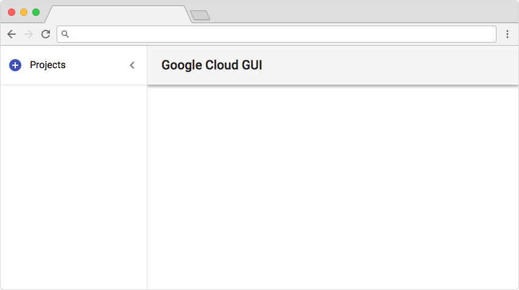
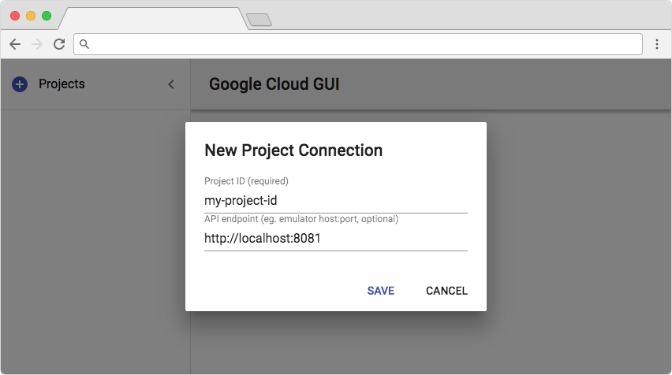
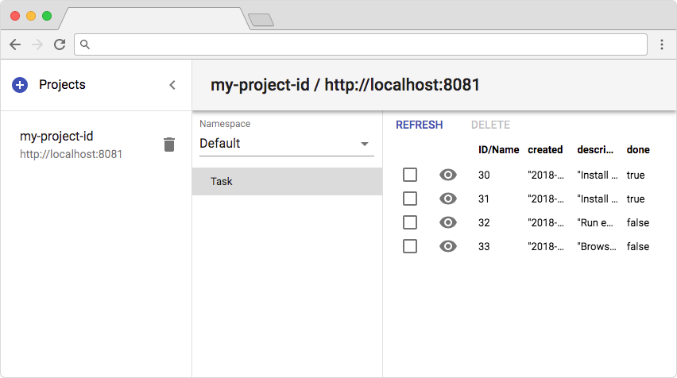
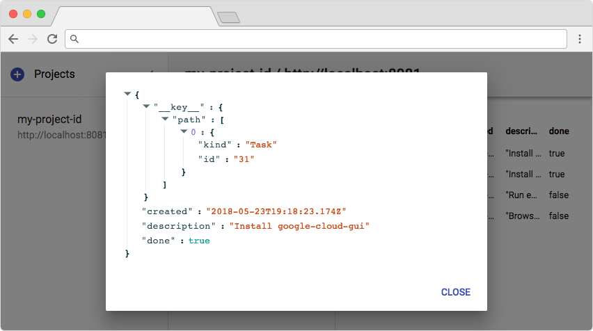

# Google Cloud GUI
At the moment, a simple GUI for Google Cloud Datastore, mostly useful for working with the Datastore emulator during development.

In the future, based on feedback from the community, support for additional Google Cloud Platform APIs may be added.

### How it works

Google Cloud GUI relies on [gcloud](https://cloud.google.com/sdk/gcloud/) for authentication. This means that in order to connect to a production datastore, you first need to `gcloud auth login` with the credentials for your GCP project(s).

**Don't run Google Cloud GUI anywhere public, as any user who has access to it, would get access to all the projects that gcloud on that machine has access to!**

### Installation

`yarn global add google-cloud-gui` (recommended)

or

`npm i -g google-cloud-gui` (see [#1](https://github.com/GabiAxel/google-cloud-gui/issues/1) and [#2](https://github.com/GabiAxel/google-cloud-gui/issues/2) for known issues and solutions)

### Starting the server

`google-cloud-gui [--port=<PORT>] [--skip-browser]`

Optional flags:

* `--port` sets the HTTP port (default 8000)

* `--skip-browser` skips opening the GUI in the browser when the server starts

### Using the GUI

The GUI should be available at `http://localhost:<PORT>` (default `http://localhost:8000`) and will initially show no projects.

Start by adding a project by clicking the top left "+" button. In the dialog enter the project ID and the emulator host:port, or leave it empty to use the production Datastore.

The projects are stored in the file `~/.google-cloud-gui-db.json`

After adding a project, you will be able to browse the Datastore namespaces, kinds and entities.

At the moment you can only view and delete entities (no creation or editing). Click the eye icon to view an entity as a tree (useful for large or nested entities that don't fit in a table row).

### Development

The project is composed of `server` and `client` directories. To run locally:

* Under `server` run `yarn start` - this will start the server on port 8000 with Nodemon for auto-reload on sources change.

* Under `client` run `yarn start` - this will start a development server on port 3000 and open the browser at `http://localhost:3000`

To build locally, under the project root run `build.sh` - this will create the `build` directory with the server and transpiled client. Under `build` run `server.sh` to run the server and client locally on the same port.
